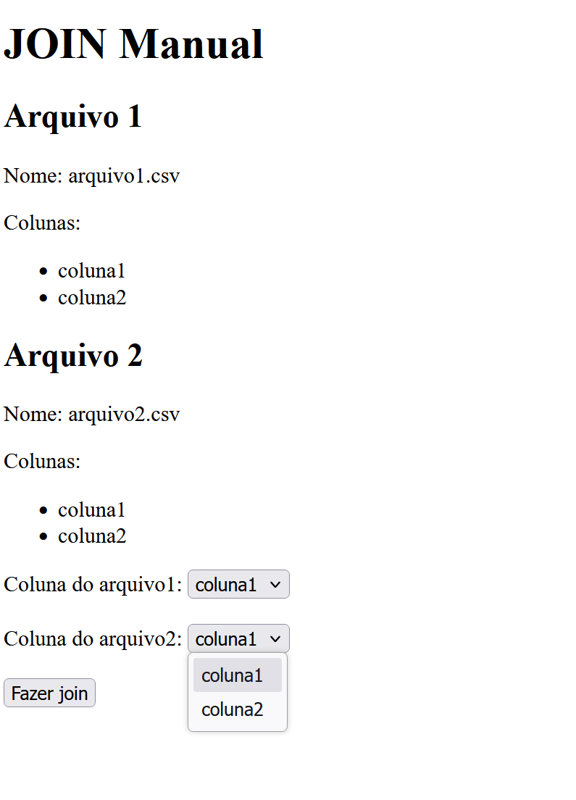

# .net Framwork 4.5 - 4.8.2

Uma boa parte da nossa base de código ainda não foi migrada para versões mais recentes, o que está sendo feito gradativametne e ainda deve levar alguns anos. Por isso é importante que você esteja a vontade. Ainda que a nossa aplicação seja uma API consumida por um client typescript, nesse teste, precisamos que seja construída uma aplicação MVC, com Razor.

## 1.1 - Upload de arquivos

Crie uma aplicação MVC com Razor que permita o upload de arquivos. Deve haver uma página com espaço de uplaod de arquivos, que uma vez feito o upload, o arquivo seja gravado em uma pasta no servidor. Somente arquivos .CSV de até 50MB devem ser permitidos. Ao subir um arquivo, o **servidor** deve verificar se o arquivo é um CSV, separado por vírgulas, com aspas delimitadoras:
```csv
"Nome","Sobrenome","Idade"
"João","Silva",30
"Maria","Santos",25
```


Observe que nem o número de colunas, nem os nomes dessas devem ser esses, o sistema deve permitir o upload de qualquer CSV cuja estrutura atenda os reuqisitos de formato.

## 1.2 - "JOIN" manual

Nessa mesma aplicação, deve haver uma página com dois dropdowns, em cada um deve aparecer os nomes dos arquivos armazenados na pasta de uploads da questão anterior. 


Ao selecionar os dois arquivos, e clicar em avançar deve ser exibida uma página com as listas das colunas de cada arquivo. 



Ao selecionar uma coluna de cada arquivo e clicar em avançar o sistema deve mesclar os dois arquivos, gerando um terceiro, disponível para download. Essa mescla deve sser feita, por exemplo, da seguinte maneira:

- Arquivo 1:
```csv
"ID","Nome","Idade"
1,"João",30
2,"Maria",25
3,"José",40
4,"Ana",35
5,"Carlos",20
6,"Marta",45
```

- Arquivo 2:
```csv
"ID","Partidas","Pontos"
1,10,7
2,10,6
6,8,4
7,9,5
8,10,6
11,10,7
```

- Mescla:
```csv	
"ID","Nome","Idade","Partidas","Pontos"
1,"João",30,10,7
2,"Maria",25,10,6
6,"Marta",45,8,4
```

Ou seja, a mescla deve ser feita, com base na coluna selecionada, mesclando as linhas de cada arquivo que possuem o mesmo valor nessas colunas. As linhas dos arquivos resultantes devem começar com a coluna do arquivo 1 usada na mescla, e em seguida as demais colunas do arquivo 1, seguidas das demais colunas do arquivo 2.

A aplicação deve estar preparada para lidar com arquivos grandes, com centenas de milhares de linhas, a mescla deve ser feita do modo mais eficiente possível, considerando que o servidor possuirá mais de 1GB de RAM e 2 vCPUs.

## IMPORTANTE

**Não devem ser utilizadas bibliotecas de terceiros, além das disnpoíveis no próprio .net**

Não se preocupe com a aparência da aplicação, o importante é que a aplicação funcione corretamente.

Nessa parte avaliaremos a capacidade de resolver problemas, não estaremos preocupados com aspectos arquiteturais como separação de responsabilidades e extensibilidade do código.