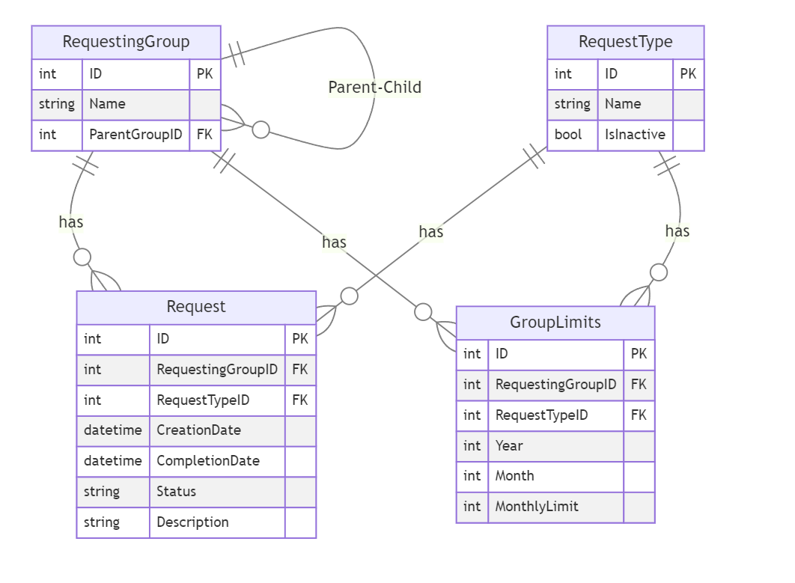

# API Rest com .net 8

Nessa parte do teste, você deve criar uma API Rest com .net 8 (na verdade, qualquer versão superior a 6), que permita a criação, edição, exclusão e listagem de 2 entidades que descreveremos mais a baixo. 

## Entidades

As seguintes entidades devem ser implementadas, o armazenamento deve ser feito em um banco SQL Server:
- Grupo solicitante
- Tipo de solicitação
- Solicitação
- Limites por grupo

### Descrição das unidades

Abaixo um resumo do que cada entidade deve possuir

#### Grupo solicitante

Deve ter Nome, ID e "Grupo pai", ou seja, é uma entidade recursiva.

#### Tipo de solicitação

Deve ter ID, Nome e flag de inativo.

#### Solicitação

Deve ter ID, ID do grupo solicitante, ID do tipo de solicitação, Data de criação, Data de conclusão, Status (aberto, fechado, cancelado), e Descrição.

#### Limites por grupo

Deve ter ID, ID do grupo solicitante, ID do tipo de solicitação, Ano, mês e limite por mês.

### Requisitos do banco de dados criado

O banco de dados pode ser criado com migrations ou scripts SQL, mas deve ser entregue junto com o código da aplicação. O banco de dados deve possuir primary keys e Foreign keys criadas de acordo com as boas práticas de modelagem de dados e deve possuir índices criados de modo a garantir que os endpoitns descritos a seguir tenham boa escalabilidade.

#### Sugestão de modelagem

Essa é uma sugestão de modelagem. Fique a vontade de utilizar nomes em português ou inglês, utilizar outros tipos para as chaves ou fazer outras modificações que achar interessantes.

## Endpoints da API

A API deve possuir os seguintes endpoints:

### Grupo solicitante
- GET - listando todos os grupos solicitantes
- GET */{id}* - retornando um grupo solicitante por ID
- GET */{idPai}* - retornando todos os grupos solicitantes filhos de um grupo pai
- POST - criando um novo grupo solicitante
- PUT */{id}* - editando um grupo solicitante
- DELETE */{id}* - excluindo um grupo solicitante

A edição de um grupo solicitante deve permitir a alteração do grupo pai, mas não deve permitir a alteração do ID. Além disso deve garantir que não haja ciclos na relação de grupos pais.
Não deve ser possível excluir um grupo solicitante que possua solicitações associadas. A hierarquia pode ter até 5 níveis, isso é ` Grupo 1`, `Grupo 1.1`, `Grupo 1.1.1`, `Grupo 1.1.1.1`, `Grupo 1.1.1.1.1`.

### Tipo de solicitação
- GET - listando todos os tipos de solicitação
- POST - criando um novo tipo de solicitação
- PUT */{id}* - editando um tipo de solicitação
- DELETE */{id}* - excluindo um tipo de solicitação

A exclusão de um tipo de solicitação deve ser possível apenas se não houver solicitações associadas a ele. Caso haja, deve-se inativar o tipo de solicitação. A regra deve ser "transparente" para o usuário.

### Solicitação
- GET - listando todas as solicitações
- PUT */{id}* - editando uma solicitação
- DELETE */{id}* - excluindo uma solicitação
- POST - criando uma nova solicitação

A criação de solicitações deve validar se o grupo solicitante e o tipo de solicitação existem, e se o grupo solicitante possui limite para o tipo de solicitação no mês corrente. Caso não exista, deve retornar um erro com a mensagem adequada. A tabela de limites NÃO deve ser editada diretamente, apenas consultada, isto é, ela sempre tem o limite total e não o limite disponível. A não existência de um limite indica que o grupo solicitante não pode criar aquele tipo de solicitação. Limites de grupos pais só devem ser considerados se o grupo solicitante não possuir limite próprio.

### Limites por grupo
- GET - listando todos os limites
- POST - criando um novo limite
- PUT */{id}* - editando um limite existente
- DELETE */{id}* - excluindo um limite
- GET */{idGrupo}/{idTipo}/{ano}/{mes}* - retornando o limite de um grupo para um tipo de solicitação em um mês específico

A criação de limites deve garantir que não haja mais de um limite para um grupo em um tipo de solicitação em um mês. A edição de um limite deve garantir que o limite não seja menor que a quantidade de solicitações já existentes no mês. A exclusão de um limite deve garantir que nenhuma solicitação existente passe a estar fora do limite.

## Aspectos da aplicação
É importante que a aplicação observe os seguintes pontos:
- Mesmo que testes não sejam implementados, a aplicação deve ser construída de modo a permitir a fácil implementação de testes unitários e de integração.
- A aplicação deve ser construída de modo a permitir a fácil implementação de logs, e deve possuir logs de erro e de acesso.
- As modificações de dados (Create, Update e Delete) devem disparar eventos na própria aplicação que possam ser consumidos por outras partes da aplicação, por exemplo, para futura atualização de caches, postagens em filas, e etc.

Fique a vontade para organizar a aplicação em camadas, implementar os patterns que achar necessário, e utilizar as bibliotecas que achar adequadas. Para o acesso a dados, sugerimos o uso do Entity Framework, mas Dapper ou outros ORMs são aceitáveis.

## Importante

Nessa parte do teste avaliaremos conhecimentos de design, arquitetura e boas práticas. Não é necessária a implementação de testes.

Quantos mais pontos dos requisitos forem atendidos, mais precisa será a avaliação.

A não utilização de técnicas e abordagens poderá ser defendida na entrevista, então evite o overengineering.